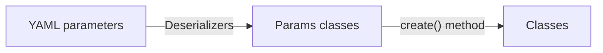
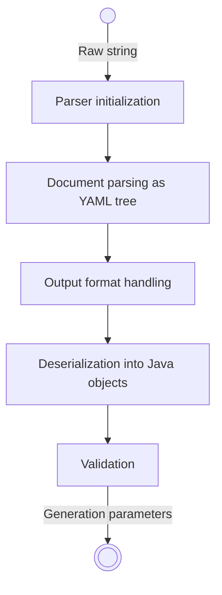

# Parameters

> [!NOTE]
> This is the **developer** documentation of parameters. This explains how Voxatile manages them internally, how to create new ones, and documents special tools available for that.
>
> If you want to learn how to **use** existing parameters instead, please refer to the [usage documentation](../../usage/parameters/Parameters.md).

## Table of contents

* [Introduction](#introduction)
* [Parameters, params classes, and regular classes](#parameters-params-classes-and-regular-classes)
* [Parsing and deserialization](#parsing-and-deserialization)
* [Adding custom parameters](#adding-custom-parameters)

## Introduction

_Parameters_ refer to the complete description of the requested generation. They are read from the content of the file those path is given by the [`-p` / `--param-file` command-line argument](../../usage/Generator.md#command-line-arguments), or alternatively directly from the content of the [`VOXATILE_PARAMS` environment variable](../../usage/Generator.md#voxatile_params).

They are encoded as [YAML](https://yaml.org/) (and consequently can also be encoded as JSON), and must all be in a single [_YAML document_](https://www.yaml.info/learn/document.html). Anchors (`&`), references (`*`) and merging (`<<`) can be used.

## Parameters, params classes, and regular classes

To understand how responsibilities are defined regarding parameters, we differentiate 3 concepts.

First, there are the text-encoded parameters. We usually refer to them as _parameters_ (full word), or _YAML parameters_, or sometimes just _the YAML_. Those are the raw encoded values in YAML format, that the user interacts with to customize its generation.

Second, there are the Java classes created automatically from the _parameters_. We refer to them as _params classes_, or just _params_ (abbreviated like this). Those are Java classes located under the `parameters` package, and ending with the `Params` suffix. They are what the deserialization process creates automatically (using [_deserializers_](Deserializers.md)).

Third, there are the regular Java classes that actually do the job. We don't use particular terminology to refer to them, other than _classes_ that are not _params_. Those are all the other Java classes, with actual code inside them to generate worlds. _Params classes_ almost always have a `create` or similar method to instantiate regular _classes_ from them.

To some extent, we can consider regular _classes_ as the back-end, _params classes_ as the API and _parameters_ as the front-end. Having a clear separation of them allows to make changes in either of them (front or back) without having to modify the other.
For example, it allows introducing additional _parameters_ syntaxes using the same back-end _classes_ (perhaps with different presets), to make _parameters_ more readable or easier to write.
In the future, it would also allow to maintain backward compatibility even with changes in back-end _classes_, by keeping deprecated _params classes_ pointing at new _classes_.
**Thus, it is very important to respect this separation when writing new code.**

Typical lifecycle is:


## Parsing and deserialization

Parsing is done by the `ParamsParser` class located at the root of the `parameters` package. It relies on the Jackson library for the whole deserialization process.

The process is the following:



First, the parser is initialized. Built-in params types are registered, and [modules](../Modules.md) have the opportunity to register their own ones. Format-specific params are **NOT** yet registered because the output format is not known.

Then, the complete YAML document is parsed as a tree. Any YAML syntax error will throw an exception at this step. No params Java object has been created yet.

From that tree, the output format is extracted. Format-specific params are then registered to the parser. This includes for example voxel placeable params, which depend on the output format.

Now that everything needed has been registered into the parser, the whole tree parsed earlier is deserialized into params Java objects (using [_deserializers_](Deserializers.md)). Any basic YAML schema error, such as unknown type or missing property, will throw an exception at this step.

Finally, the newly-created params are validated. This triggers the custom validation method of every params, after all of them were created. Any logic error will throw an exception at this step.
Note that some special errors might only be detected later at _creation_-time. This is the case for example when resolving values such as a CRS, which is only done once to avoid multiple lookups.

## Adding custom parameters

Since everything in Voxatile is driven by the user's request, every feature must have corresponding parameters to be usable. This means that when developing a new implementation of an existing concept, a new params class should probably be created as well. This is not always true because bindings between classes and params are not 1:1, but most of the time it is the case.

Params classes are Java classes those fields are **`public`** and represents _properties_. Each property usually maps to a YAML parameters key-value pair. Annotations such as `@JsonSetter` or `@JsonFormat` can further customize behavior of those properties. Mandatory properties are included in the constructor, annotated with `@ConstructorProperties`.

Since params objects are instantiated programmatically by Jackson (using [deserializers](Deserializers.md), properties cannot have _any_ type. Usable types include:
- Primitive types (`int`, `boolean`...)
- Standard Java types (`String`, `BigInteger`...)
- Enum types (prefer creating a params `enum` mapping to the real enum)
- Other params classes (make sure to use the params type and not the regular one!)
- Collections of usable types (arrays, `List`, `Map`...)
- Record of usable types
- Wildcard type `JsonNode`

When creating a new implementation of an existing concept (a new task, a new provider...), it must inherit from that concept's params class (`TaskParams`, `ProviderParams`...) and thus implement `validate` and `create` methods. Otherwise, similar methods should be created when relevant.

Finally, params classes should either be used directly in other params classes' properties, or be registered in the `ParamsParser` to be usable. See `ParamsParser#registerParams()` for more information.

Example:

```java
public class MyTypeParams {
    @JsonSetter(nulls = Nulls.FAIL)
    public String requiredString;
    
    @JsonSetter(nulls = Nulls.SKIP)
    public int optionalInt = 1;

    @JsonSetter(nulls = Nulls.FAIL, contentNulls = Nulls.FAIL)
    @JsonFormat(with = JsonFormat.Feature.ACCEPT_SINGLE_VALUE_AS_ARRAY)
    public List<MyOtherParams> complexProperty;
    
    @ConstructorProperties({ "requiredString", "complexProperty" })
    public MyTypeParams(String requiredString, List<MyOtherParams> complexProperty) {
        this.requiredString = requiredString;
        this.complexProperty = complexProperty;
    }
    
    public void validate() {
        if (requiredString.isBlank())
            throw new IllegalArgumentException("'requiredString' must not be empty or blank");
        if (optionalInt <= 0)
            throw new IllegalArgumentException("'optionalInt' must be greater than 0");
    }
    
    public MyType create(Generation generation) {
        return new MyType(
            requiredString,
            optionalInt,
            complexProperty.stream().map(p -> p.create(generation)).toList()
        );
    }
}
```

See actual params classes in the `parameters` package to find more examples.
