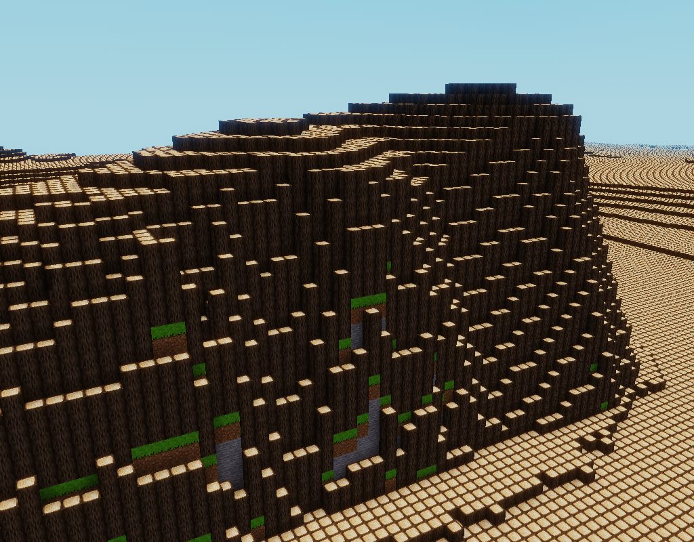
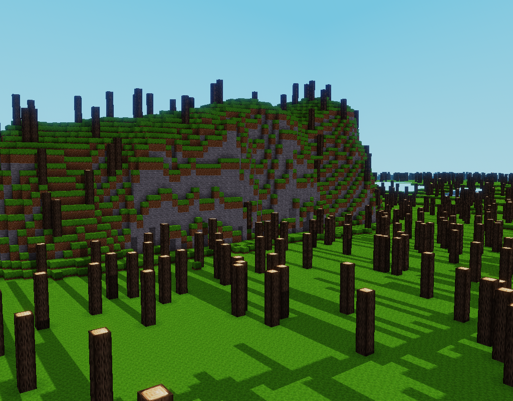
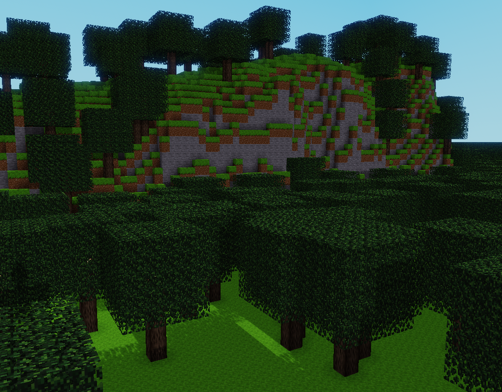
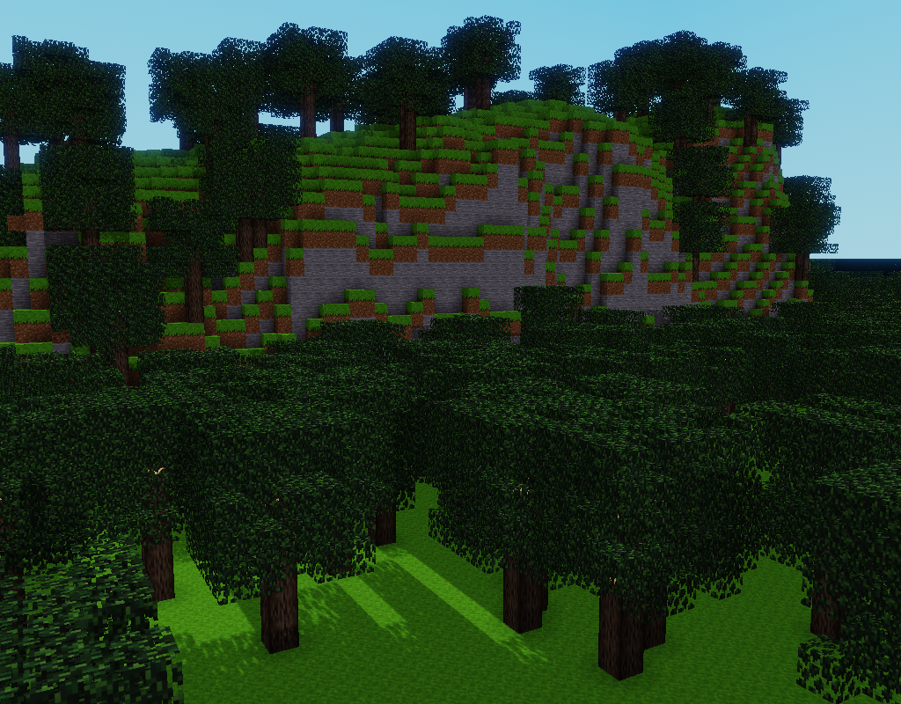

# How to grow a forest

In [How to start from scratch](scratch.md), we've built very rudimentary trees.

Here, we will start with ground resulting from [How to build ground](ground.md). We will cover all the area with a big forest. Later this forest (or any other kind of generated decor) could be used to fill corresponding geographical areas.

But the goal for now is to play with structures and pattern.

## First try, first fail

Let's first try to place tree trunks. We start with a file resulting from [How to build ground](ground.md), but without fancy grass on ground:

```yaml
worldName: Forest
format: luanti
area:
  center:
    latitude: 48.8822
    longitude: 2.3819
  extentX: 1000
  extentY: 1000

heightmaps:
  ground:
    default: 0

forEachTile:
  fetch-elevation:
    type: fetchData
    modelType: elevation
    provider:
      type: wmsFloat
      url: https://data.geopf.fr/wms-r/wms
      layer: RGEALTI-MNT_PYR-ZIP_FXX_LAMB93_WMS

  populate-ground:
    after: fetch-elevation 
    type: populateHeightmap
    models:
      type: elevation
    heightmap: groundit

  spawn:
    after: populate-ground
    type: setSpawn
    heightmap:
      sum: [ground, 2]
    x: 0
    y: 0

  ground:                    # Groud but with no fancy grass
    after: populate-ground
    type: renderHeightmap
    at: ground
    place:
      structure:
      - at: [0, 0, 0]
        put: default:dirt_with_grass
      - at: [0, 0, -1]
        put: default:dirt
      - at: [0, 0, -9..-2]
        put: default:stone           

  forest:                    # New task for our forest
    after: ground            # Starts after ground drawn
    type: renderHeightmap    # We will cover all the area
    at:
      sum: [ground, 1]       # We start drawing voxel over ground
    place:
      structure:             # And we try placing trunks
        at: [0, 0, 0..4]     # ... made of 5 stacked
        place: default:tree  # ... default:tree voxels
```

### Result

We have way too many trunks!



### Explanation

We have placed five voxel hight tree trunks **everywhere**, at each map position.

## Second try with more spacing

Instead of placing the same structure everywhere, we will place it in a random *pattern* with a 1/50 chance.

From here, we will modify only the `forest` task (and actually, only its `place` field). The rest of the file stays the same :

```yaml
  forest:
    after: ground
    type: renderHeightmap
    at:
      sum: [ground, 1]
    place:
      pattern:                   # Instead of a structure, place a pattern.
        chance: 0.02             # This is a random pattern with 1/50 chance
        place:                   # ... of placing
          structure:             # ... the same trunk structure as previously
            at: [0, 0, 0..4]
            put: default:tree
```

### Result



### Explanation

`place` field accept different things: voxel, structure, patterns. We call them *placeable* because they can simply be placed.

A *voxel* is the atomic placeable, it consist in a single voxel (as already seen in [How to start from scratch](scratch.md)).

A *structure* is a set of voxels placed together. For example, our trunks.

A *pattern* is a placeable which varies according to the position. Here, we use a random pattern which places something (a placeable) with a certain change.

Our random pattern has a `place` field to tell what to place. This file also holds a placeable description which could be a single voxel, a structure or another pattern.

Placeable definitions could be indefinitively nested. We can have patterns placing structures made of patterns placing other structures of structures. This is a very powerful tool for generation.

## Add some leaves

Now we want our trunks look like trees. They're only missing leaves. To start, we could add a simple 5x5 cube of leaves around the top of the trunc:

```yaml
  forest:
    after: ground
    type: renderHeightmap
    at:
      sum: [ground, 1]
    place:
      pattern:
        chance: 0.02
        place:
          structure:
          - at: [-2..2, -2..2, 3..7] # In a 5x5x5 cube
            put: default:leaves      # ... put some leaves
          - at: [0, 0, 0..4]         # Note the minus sign here
            put: default:tree
```

### Result

Trees are a bit squarish but yet they look good:



### Explanation

We just updated our structure, adding a cube of leaves.

Structure is defined here (like in [How to build ground](ground.md)) by a list of `at` / `put`.

`at` tells the cube area to set. Each three coordinates (*x*, *y*, *z*) can be a number or an interval. Remember *z* is vertical whereas *x* and *y* are horizontal.

So here, we fill a cube from -2 to 2 in *x* and *y* and from 3 to 7 in *z* with `default:leaves`.

As they are on the top of the list, leaves are drawn first. Then the trunk is drawn, overwritting overlapping positions. Thats why the trunk sinks into leaves.

## Make trees less squarish

We could draw a sphere of leaves but there are no settings for that yet. And anyway that won't look that natural.

Another way is to use a nested random pattern for leaves:

```yaml
  forest:
    after: ground
    type: renderHeightmap
    at:
      sum: [ground, 1]
    place:
      pattern:
        chance: 0.02
        place:
          structure:
          - at: [-2..2, -2..2, 3..7]
            put:                 # Put also takes a placeable
              pattern:           # Use a random pattern
                chance: 0.5      # With a 1/2 chance
                put: default:leaves
          - at: [0, 0, 0..4]
            put: default:tree
```

## Result

Now trees look better:




MISSING:
- If we had a switch statement we could do better
- If we have default distinct random seed, it would be simpler