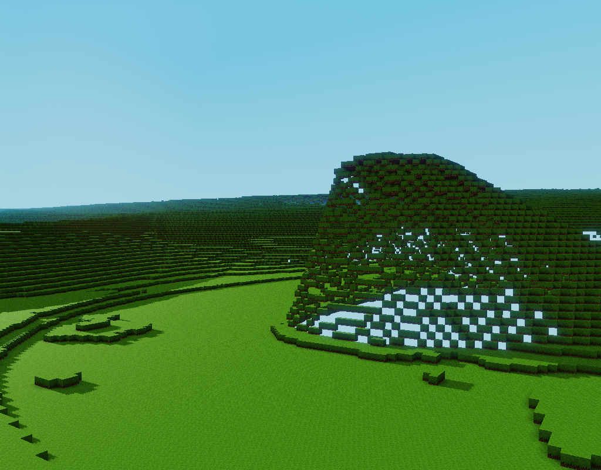
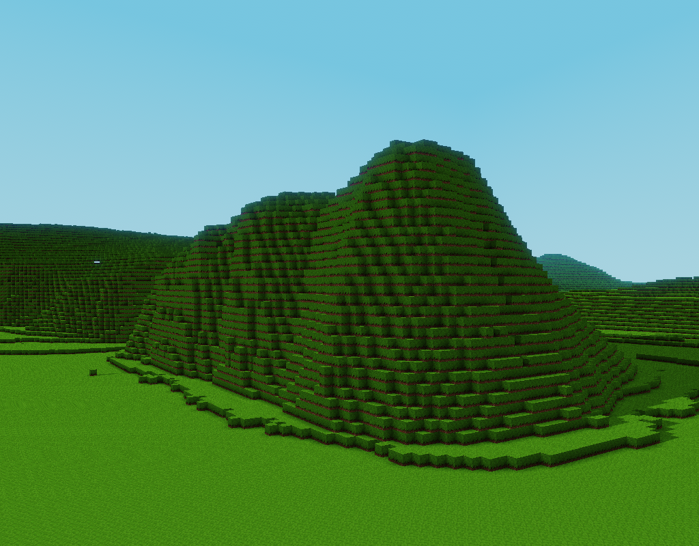
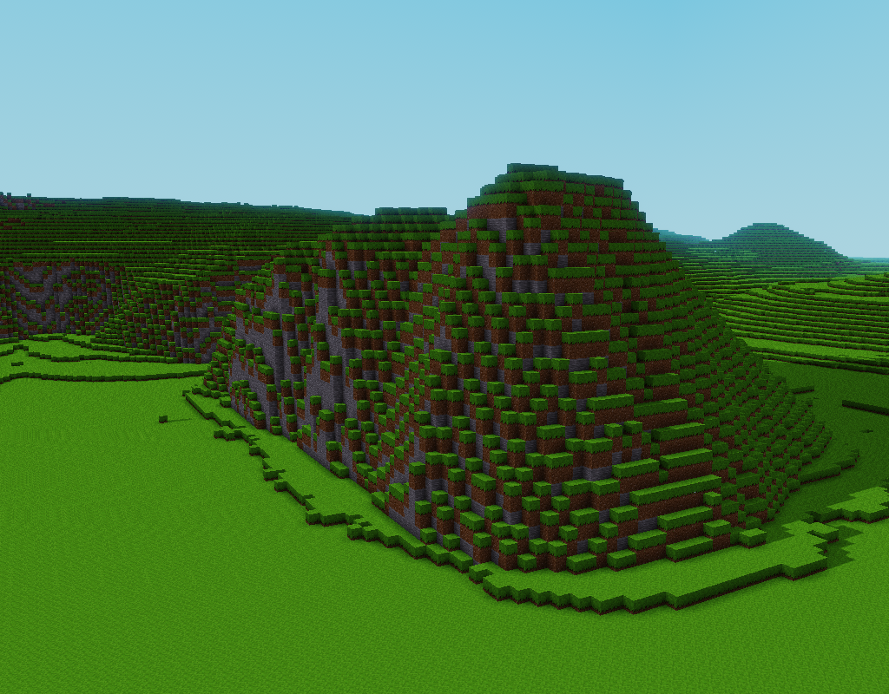
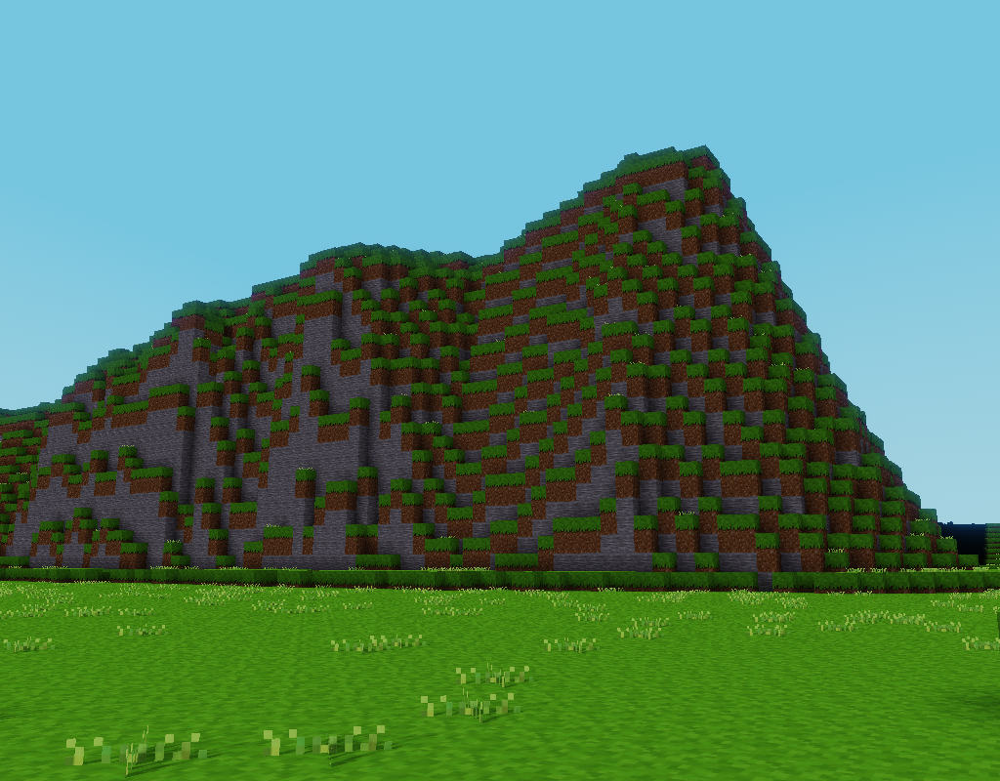

# How to build ground

In [How to start from scratch](scratch.md), we've built a very rudimentary ground by placing one voxel at altitude 0. This works well if the terrain is flat, but on hills, we see there are some holes.

## Holes in the hills

Let's start with a configuration similar to the one built in [How to start from scratch](scratch.md), but with only ground stuff:

```yaml
worldName: Ground
format: luanti
area:
  center:
    latitude: 48.8822
    longitude: 2.3819
  extentX: 1000
  extentY: 1000

heightmaps:
  ground:                   # This heightmap will be populated with altitude
    default: 0

forEachTile:
  fetch-elevation:          # This task will fetch altitude data into a model
    type: fetchData
    modelType: elevation    # Store data in "elevation" models
    provider:
      type: wmsFloat        # Use "WMS" with float values
      url: https://data.geopf.fr/wms-r/wms      # IGN WMS URL
      layer: RGEALTI-MNT_PYR-ZIP_FXX_LAMB93_WMS # IGN DEM layer

  populate-ground:          # This will task copy data from model to heightmap
    after: fetch-elevation 
    type: populateHeightmap
    models:
      type: elevation       # Take data from "elevation" models
    heightmap: ground       # Populate "ground" heightmap with it

  spawn:                    # This task places the player at a decent position
    after: populate-ground
    type: setSpawn
    heightmap:
      sum: [ground, 2]
    x: 0
    y: 0

  ground:                   # This task draws the ground voxels
    after: populate-ground
    type: renderHeightmap
    at: ground              # Get altitude from "ground" heightmap
    place: default:dirt_with_grass
```

### Result

This results in a grass landcape. Flat areas are ok but steep hills show holes in their sides:



### Explanation

We placed only one voxel at terrain altitude. Nothing over, nothing under. If two side by side voxels have more than one voxel difference in altitude, we can see under the higher one.

Solution is to place some underground voxels.

## Simple but not so good solution

As of now, we will only change `ground` task. The rest of the file will remain the same.

In [How to start from scratch](scratch.md), we simply repeated the same voxel ten times vertically to draw buildings. We could do the same:

```yaml
  ground:
    after: populate-ground
    type: renderHeightmap
    at: ground
    place:
      structure:
        at: [0, 0, -9..0]            # Place a ten voxels stack
        put: default:dirt_with_grass  # ... made of grass
```

### Result

Now we have no more holes:



### Explanations

Like for building, we defined a structure which is a 1x1x10 stack (at 0, 0) but this one goes downwards (from -9 to 0), so it will be placed under the ground.

So at each horizontal position, ten voxels of grass are stacked.

## Better looking solution

Stacking grass voxel is unusual in game. Groud is usualy made of a stone / dirt / grass stack. Let's try that.

```yaml
  ground:
    after: populate-ground
    type: renderHeightmap
    at: ground
    place:
      structure:
      - at: [0, 0, 0]                 # Notice we added a "-" sign
        put: default:dirt_with_grass  # we now have a list of at/put
      - at: [0, 0, -1]                # Under the grass voxel
        put: default:dirt             # put a dirt voxel
      - at: [0, 0, -9..-2]            # and under the dirt voxel
        put: default:stone            # put stone voxels
```

### Result

Now we have stone cliffs:



### Explanation

Previous simple stack structure has been replaced by a combination of tree different stacks. A single voxel of grass, on top on a single voxel of dirt, on top of a height stone voxels stack.

Note that this combination is simply represented by a list (with minus signs) of `at`/`put` couples. There are other ways of defining structures. These ways can also be used as a part of that list.

## Makes things fancy

Large grass areas are boring. We could decorate our ground with some random stuff.

```yaml
  ground:
    after: populate-ground
    type: renderHeightmap
    at: ground
    place:
      structure:
      - at: [0, 0, 1]
        put:
          pattern:
            chance: 0.1
            place: default:grass_1
      - at: [0, 0, 0]
        put: default:dirt_with_grass
      - at: [0, 0, -1]
        put: default:dirt
      - at: [0, 0, -9..-2]
        put: default:stone
```

### Result

The rock seen from ground.



### Explanation

On top of ground, we added a `pattern`. Patterns allows to render voxels that vary according to position. Here we used a random pattern that places `default:grass_1` with a change of one out of ten.

For more information about structures and patterns, you can follow [how to render forests](forests.md).

## Resulting parameter file

You can find the resulting parameter file of this howto [here](params/ground.yaml).