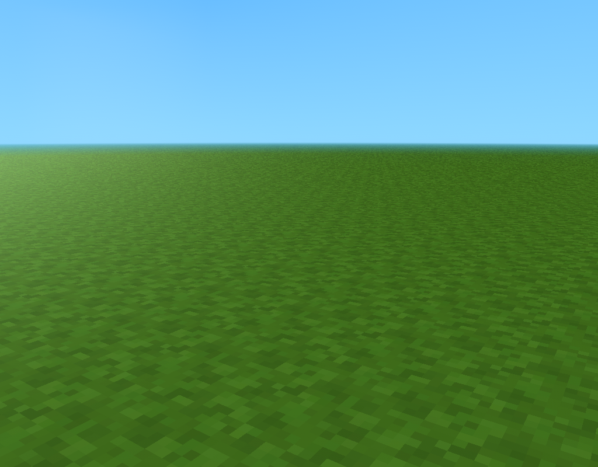
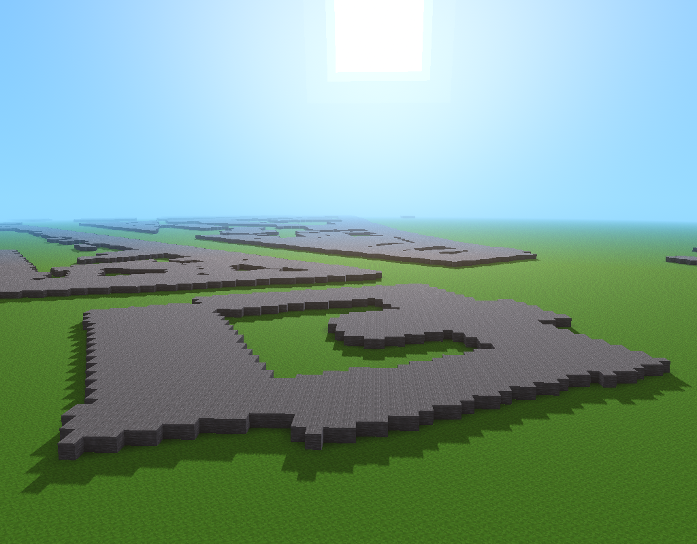
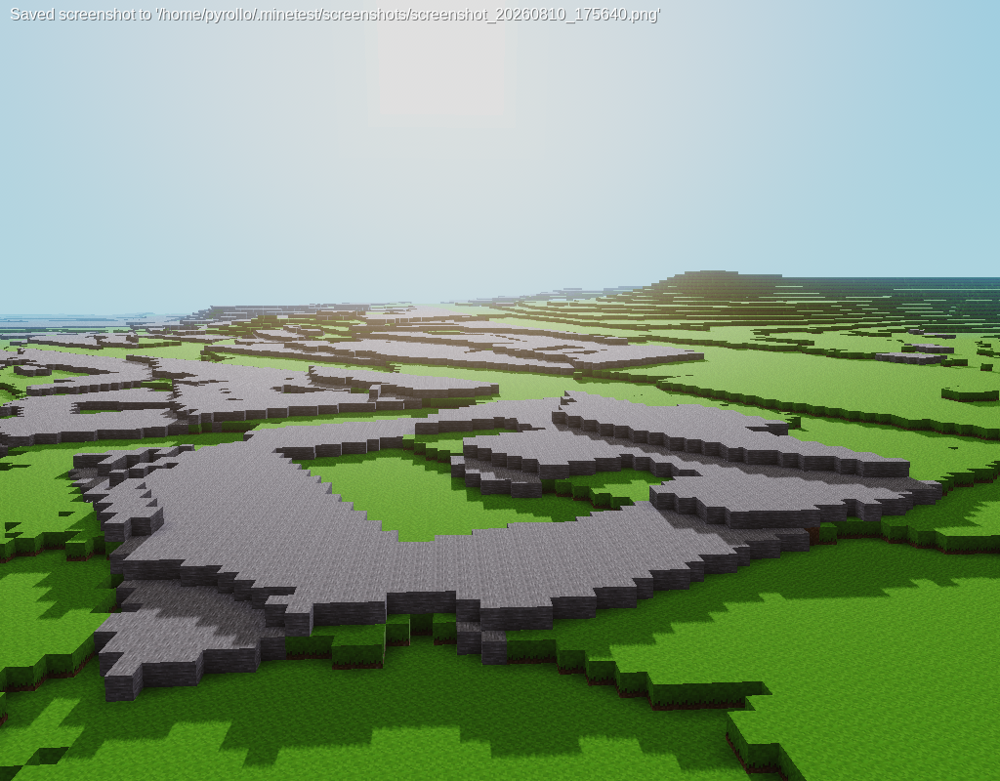
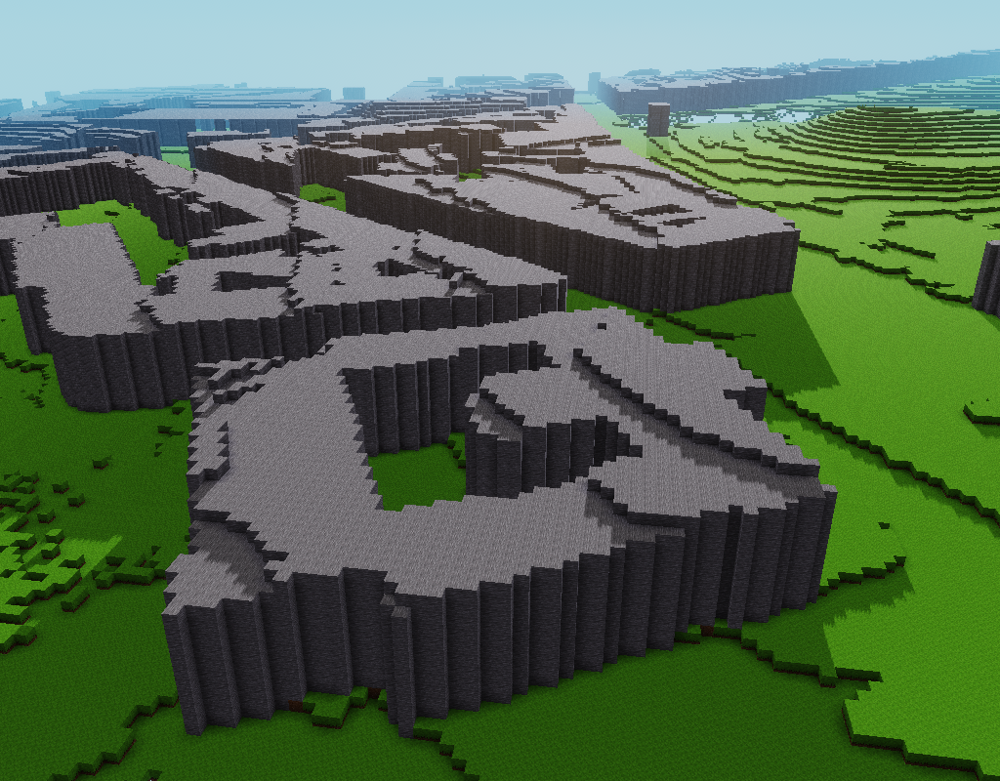
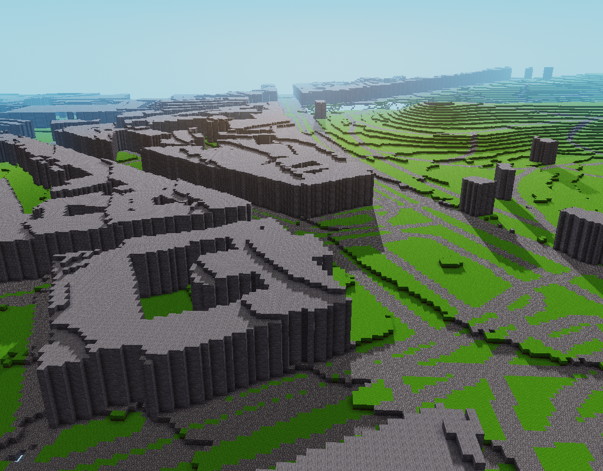
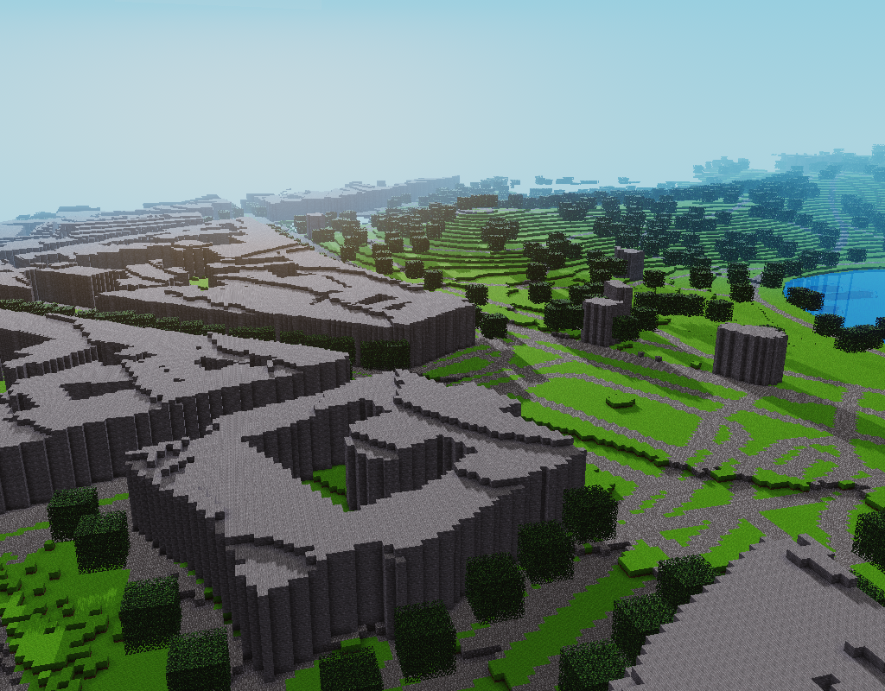

# How to start from scratch

New to voxel generator parameters? You are in the right place.

Here we will start to build a simple basic world from scratch.

## Minimal parameter file

Here is a very minimal parameter file:

```yaml
worldName: Scratch    # Name of the world in the game
format: luanti        # Output format (Luanti / Minetest)
area:
  center:
    latitude: 48.8822 # Center point of the map in real world
    longitude: 2.3819 # (Paris - Buttes Chaumont here)
  extentX: 1000       # Size of the resulting world in voxels
  extentY: 1000
```

This will create an empty world.

### Explanations

As we haven't specified any redering task to perform, nothing is rendered and so, the world is empty.

## Flat world

If we want to generate something, we have to add tasks. Tasks are the base components of generation. For now, we will add one task, in the `ForEachTile` schedule (a schedule run on each generated tile).

```yaml
worldName: Scratch
format: luanti
area:
  center:
    latitude: 48.8822
    longitude: 2.3819
  extentX: 1000
  extentY: 1000

forEachTile:

  ground:                          # Task name
    type: renderHeightmap          # Task type (draw at a given height)
    at: 0                          # Draw at altitude 0
    place: default:dirt_with_grass # Draw dirt with grass
```

### Result

A dull flat world, but not empty:



### Explanations

A task named `ground` has been added. It is of `renderHeightmap` type. In short, such tasks place something at every horizontal coordinates and at a given altitude.

Here we asked to place `default:dirt_with_grass` voxels at altitude 0. This results in a vast grass plain.

## Add some data

We would like to add some geographical data on our map. For example buildings.

We will need two more tasks for that:
* One for fetching data
* One for drawing buildings

```yaml
worldName: Scratch
format: luanti
area:
  center:
    latitude: 48.8822
    longitude: 2.3819
  extentX: 1000
  extentY: 1000

forEachTile:rec
  ground:
    type: renderHeightmap
    at: 0
    place: default:dirt_with_grass

  fetch:                   # A new task named fetch
    type: fetchData        # We want to fetch some data
    modelType: buildings   # ...and store them in "buildings" models
    provider:
      type: overpass       # Get data from OSM with Overpass API
      url: https://overpass-api.de/api/interpreter
      query: nwr[building] # Get all elements with "building" tag
    retry: 2               # Retry fetch two times before giving up (optional)
    retryDelay: 2          # Leave a 2s delay between retries (optional)

  buildings:               # Another new task named buildings
    after: fetch           # Start only once fetch task ended (i.e. when we have data)
    type: renderSurfaces   # We want to draw surfaces
    models:
      type: buildings      # Draw shapes of from "buildings" models
    heightmap: 1           # Shapes will be drawn at altitude 1
    place: default:stone   # Place stone on each shape voxel
```

### Result

Now, our plain has flat building shapes made of stone on it. Note that these building shapes corresponds to reality.



### Explanations

The `fetch` task fetches data that will be used for drawing buildings.

It uses an `overpass` provider (see [Overpass API](https://wiki.openstreetmap.org/wiki/Overpass_API)) to fetch [OSM](https://www.openstreetmap.org) data but any type of vector data representing surfaces could be used.

`url` and `query` are `overpass` provider specific fields. `url` tells where to perform queries. `query` is the filter to apply to get correct data (here any Node, Way or Relation with `building` tag).

Retrying (`retry` and `retryDelay`) is optional but it is very helpful, specially when multiplying data sources. It prevents the generation from being aborted on any temporary source failure.

The `buildings` task uses fetched data to draw buildings on ground. Here we ask to use `buildings` models, which have been retrieved by `fetch` task, and ask to place `default:stone` on their surface at altitude 1.

Why this work is separated in two tasks instead of one simple task? Because it allows to fetch data once and use it many times to perform various renderings. Tasks are as simple as possible so they can be combined with a lot of flexibility.

## Add elevation data

Our world is still kind of flat. Elevation could improve it a lot. Let's try.

In numeric cartography, altitude is provided by [Digital Elevation Models (DEM)](https://en.wikipedia.org/wiki/Digital_elevation_model). Unlike buildings which are vector data, DEM are "raster" data, like pictures but with altitude values instead of colors.

OSM has no elevation model. We will use [RGE Alti](https://www.data.gouv.fr/datasets/rge-alti-r) from IGN which is quite accurate but works only for France.

```yaml
worldName: Scratch
format: luanti
area:
  center:
    latitude: 48.8822
    longitude: 2.3819
  extentX: 1000
  extentY: 1000

heightmaps:                 # Here are declared "heightmaps"
  ground:                   # A new heightmap named "ground"
    default: 0              # Its default value is 0 everywhere

forEachTile:
  fetch-elevation:          # A new task fetching elevation data
    type: fetchData
    modelType: elevation    # Store data in "elevation" models
    provider:
      type: wmsFloat        # Use "WMS" with float values
      url: https://data.geopf.fr/wms-r/wms      # IGN WMS URL
      layer: RGEALTI-MNT_PYR-ZIP_FXX_LAMB93_WMS # IGN DEM layer

  populate-ground:          # A new task copying data from model to heightmap
    after: fetch-elevation  # Start only once fetch-elevation task ended
    type: populateHeightmap # We want to populate a heightmap
    models:
      type: elevation       # Take data from "elevation" models
    heightmap: ground       # Populate "ground" heightmap with it

  ground:
    after: populate-ground  # Must start only once populate-ground done
    type: renderHeightmap
    at: ground              # Now we want ground to be at altitude from new heightmap
    place: default:dirt_with_grass

  fetch:
    type: fetchData
    modelType: buildings
    provider:
      type: overpass
      url: https://overpass-api.de/api/interpreter
      query: nwr[building]

  buildings:
    after: [ground, fetch]
    type: renderSurfaces
    models:
      type: buildings
    heightmap: 
      sum: [ground, 1]
    place: default:stone
```

### Result


 overpass
      url: https://overpass-api.de/api/interpreter
      query: nwr[building]

  buildings:
    after: [ground, fetch]
    type: renderSurfaces
    models:
### Explanations

In order to crate hills, three things has do be added to our setting file:
- A heightmap to store elevation data, named `ground`;
- Two tasks: `fetch-elevation` and `populate-ground`;

A heightmap is somewhere to store elevation. That may sound complicated, but the idea beneath that, is that elevation data could be used and re-used by many tasks.

The `fetch-elevation` task fetches data from IGN digital elevation model. We use a `wmsFloat` provider. Its syntax is close to `overpass` except `query` is replaced by `layer` which tells what data we want.

The `populate-ground` simply copies model data into heightmap. Here, it is a very simple task but it allows some computation to be done also. Once done, it can be used to render stuff.

Note that, by default, all tasks run in parallel. We have to specify when a task needs to wait for another to finish before starting. Some `after` values has been added to make sure data is fetched before rendered and rendering is done in the correct order.
 overpass
      url: https://overpass-api.de/api/interpreter
      query: nwr[building]

  buildings:
    after: [ground, fetch]
    type: renderSurfaces
    models:
This looks a bit complex but it speeds up processing a lot. Without concurrent tasks, data would be retrieved first, one source by one source, before any rendering could start. Fortuntately, we will see later that a good organisation simplifies parametering.

## Spawn in a better place

It's likely that when starting the game, you spawn in the air deep above the ground. This is because now, surface is it at voxel above standard (0, 0, 0) starting position.

Here is a bit of black magick that adds a mod so you'll spawn in a more decent position, according to terrain altitude. Until very advanced into parametering, you won't need to tweak this task.

Add following task to your setting field somewhere among other tasks in `forEachTile`:

```yaml
worldName: Scratch
...
forEachTile:
...
# (same as above, only spawn task added)
...
  spawn:
    after: populate-ground
    type: setSpawn
    heightmap:
      sum: [ground, 2]
    x: 0
    y: 0
```

### Result

Now you spawn above ground.

## Make buildings a bit taller

Our buildings looks like parking lots. Let's give them some height.

In the parameter file, just change `place` field of `buildings` task as shown:

```yaml
worldName: Scratch
...
  # (same as above, only buildings task is changed)
  ...
  forEachTile:
  ...
  buildings:
    after: [ground, fetch]
    type: renderSurfaces
    models:
      type: buildings
    heightmap: 
      sum: [ground, 1]
    place:
      structure:           # Instead of a single voxel, we place a structure:
        at: [0, 0, 0..9]   # A 1x1x10 "cube" of...
        put: default:stone # ... default:stone voxels
```

### Result

This is far from being perfect but we yet have something that looks like a city!



### Explanations

A structure is a set of voxels placed together at once. In short (and very simplified), structure material is defined by `put` field and structure shape by `at` field. This field is a set of three numbers or intervals corresponding to the three axes (*x*, *y* and *z*). `0` stands for "at 0" and `0..9` for "0 to 9".

Note that vertical axis is *z* whereas in many games, vertical axis is *y*.

So, our structure is a 1x1 stack of 10 stone voxels. As structure are always placed from their (0, 0, 0) voxel, it is placed upwards. Placing stacks on every voxel on the surface of buildings makes them look like shoeboxes.

You'll learn how to improve buildings in another howto.
<!-- TODO: Link building howto -->


## On the road again

Now let's add some roads. As for buildings, we will add two task. One for fetching, one for drawing.

In the same file, add `fetch-roads` and `draw-roads` tasks:

```yaml
worldName: Scratch
...
forEachTile:
  ...
  # (same as above, only two tasks added)
  ...
  fetch-roads:
    type: fetchData
    modelType: roads
    provider:
      type: overpass
      url: https://overpass-api.de/api/interpreter
      query: nwr[highway]
    retry: 2
    retryDelay: 2

  draw-roads:
    after: [ground, fetch-roads]
    type: renderLines2d
    heightmap: ground
    models:
      type: roads
    structure:
      put: default:cobble
      at: [ 0, -1..1, 0]
```

### Result

Now we have kind of roads between our buildings.



### Explanations

`fetch-roads` task is very similar to `fetch` task. It only differs by its query. It selects objects with `highway` tag which is the tag for every kind of roads in OSM.

`draw-roads` is of `renderLines2d` type. This type draws two dimentional linearities on a given heightmap. Drawing is made by repeating a structure along lines. This structure is used slightly differently from previous one.

<!-- TODO: Link roads howto -->

Structure axis are used in a different manner when drawing linearities. It will be explained in another howto. Here, it draws a line of three voxel wide (y axis), one voxel high (z axis), made of cobble.

## Other elements

Many other elements could be added following the same principle: fetch data, then draw it. Here we added water surfaces and square trees.

Despite very rudimentary drawings, we yet have something that begins to look like reality:



We won't go further here. 

With this howto we saw how to start configuration of a very simple world generation from scratch. It has many issue (trees not looking like trees, holes in hills, dull areas, wobbly buildings...). Other howtos will help you solving them.
