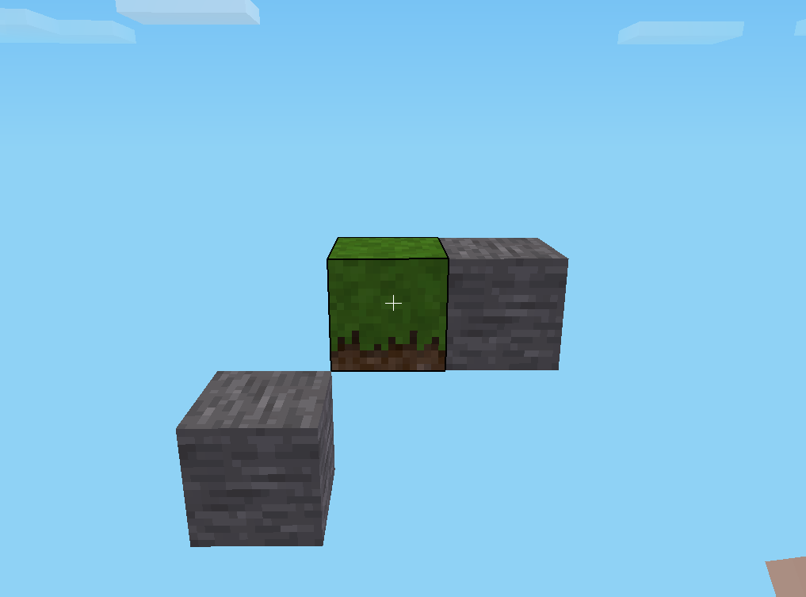
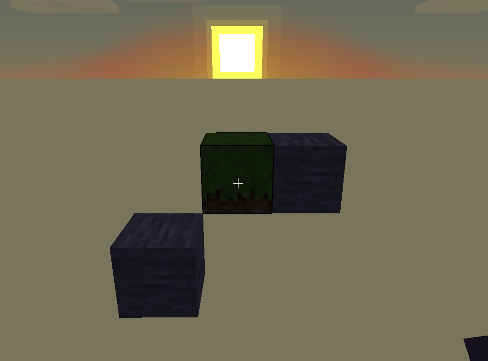

# Overview

<!-- TODO Move interesting content to docs/usage/Examples.md and rewrite a more accurate quick start -->

> [!WARNING]
> This document is not completely up-to-date! It should be reviewed / rewritten and then moved out of the `legacy` folder.

The generator has three main interfaces:
- `VoxelWorld`: Its two main methods are:
  - `save()` which is responsible for generating the game's map folder.
  - `getFactory()` which returns the associated `VoxelTypeFactory` responsible for instantiating the appropriate `VoxelType` objects.
- `VoxelType`: Its main function is the `place()` method which adds the voxel to its associated world's voxel grid.
- `VoxelTypeFactory`: This class has one method `createVoxelType()` responsible for generating a new `VoxelType`.

For each of these interfaces, there are concrete classes associated with a "game". The concrete `VoxelWorld` class for Minetest is `MTVoxelWorld`.

# Minetest example

## Step-by-step guide

### Instantiation of a `VoxelWorld`

```java
VoxelWorld minetestWorld = new MTVoxelWorld();
```

### Instantiation of a `VoxelType`

In Minetest, the term "nodes" is used to refer to its voxels. There are various of types of nodes, such as Dirt with Grass, Sand, etc.
We use `SemanticType` in order to have a generic way of calling the nodes across the different games.

Semantic types are associated with Minetest nodes in `createVoxelType()` method of `MTvoxelTypeFactory` class.

```java
// Gets minetestWorld's associated factory   
VoxelTypeFactory voxelTypeFactory = minetestWorld.getFactory();

// Creates the equivalent of a "Dirt with Grass" Minetest node
VoxelType grassVoxel = voxelTypeFactory.createVoxelType(SemanticType.GRASS);
// Creates the equivalent of a "Stone" Minetest node
VoxelType stoneVoxel = voxelTypeFactory.createVoxelType(SemanticType.STONE);
```

### Voxel placing

```java
// Places a grass voxel at the position (x = 0, y = 0, z = 0)
grassVoxel.place(0, 0, 0);

// Places a stone voxel at the position (x = 0, y = 0, z = 1)
// Note that the y- and z-axes are swapped because Minetest uses Y upward, but we use Z upward!
stoneVoxel.place(0, 1, 0);

// Places another stone voxel at the position (x = 1, y = -1, z = -1)
stoneVoxel.place(1, -1, -1);
```

### Generating the map folder

This will create a new folder named `sampleWorld` containing the necessary files for Minetest.

```java
File outputFolder = new File("/home/john/.minetest/worlds/sampleWorld/");
minetestWorld.save(outputFolder);
```

If `sampleWorld` already exists, it will be deleted first. The parent directories are created in absent.

### Result

A screenshot of the generated voxels from the perspective `(x = 5, y = -1, z = 0)`


Same perspective but during sunset. In Minetest, the sun's path aligns with the x-axis.


## Complete Code

```java
import com.ignfab.minalac.generator.outputs.minetest.MTVoxelWorld;
import com.ignfab.minalac.generator.world.MapWriteException;
import com.ignfab.minalac.generator.world.OutOfWorldException;
import com.ignfab.minalac.generator.world.SemanticType;
import com.ignfab.minalac.generator.world.VoxelType;
import com.ignfab.minalac.generator.world.VoxelTypeFactory;
import com.ignfab.minalac.generator.world.VoxelWorld;

import java.io.File;

public class SampleCode {
    public static void main(String[] args) throws OutOfWorldException, MapWriteException {
        VoxelWorld minetestWorld = new MTVoxelWorld();
        VoxelTypeFactory voxelTypeFactory = minetestWorld.getFactory();

        VoxelType grassVoxel = voxelTypeFactory.createVoxelType(SemanticType.GRASS);
        VoxelType stoneVoxel = voxelTypeFactory.createVoxelType(SemanticType.STONE);

        grassVoxel.place(0, 0, 0);
        stoneVoxel.place(0, 0, 1);
        stoneVoxel.place(1, -1, -1);

        File outputFolder = new File("/home/john/.minetest/worlds/sampleWorld/");
        minetestWorld.save(outputFolder);
    }
}
```

# How to add new voxel types

At the moment, we only support a few types of Minetest nodes. To add more:
- Add an enum constant in the `SemanticType` class.
- In the `MTVoxelTypeFactory` class, within the `createVoxelType()` method, add the corresponding case in the switch statement.
