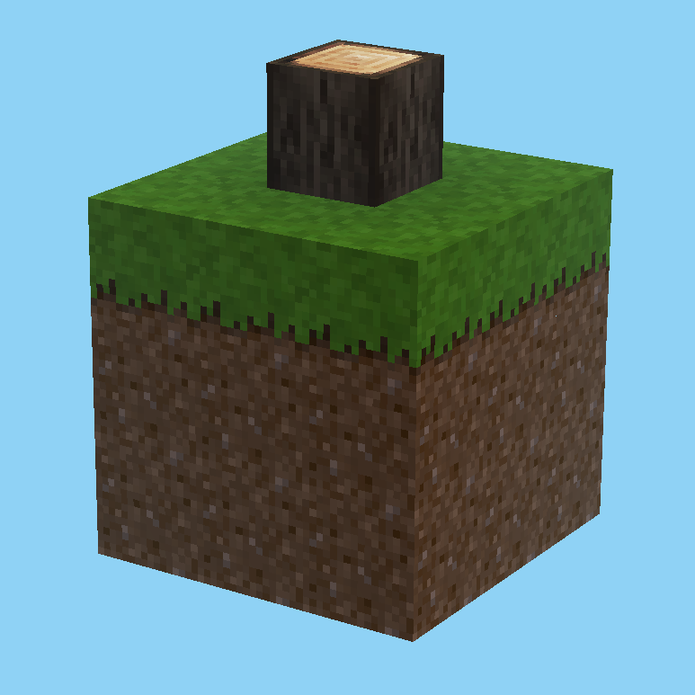
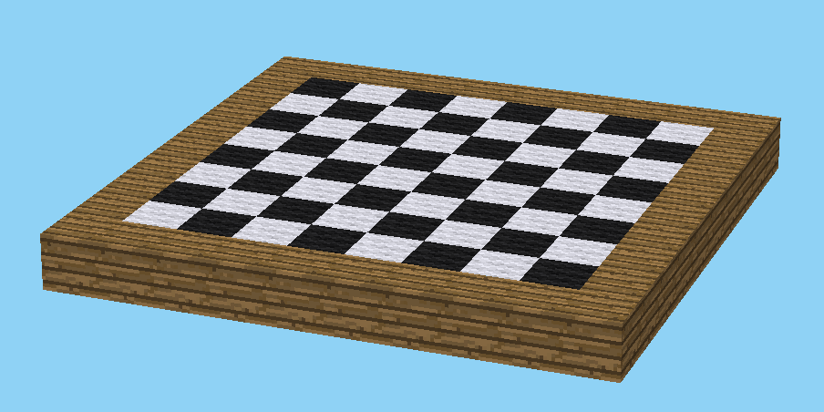
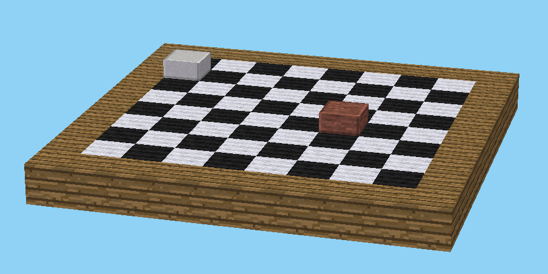
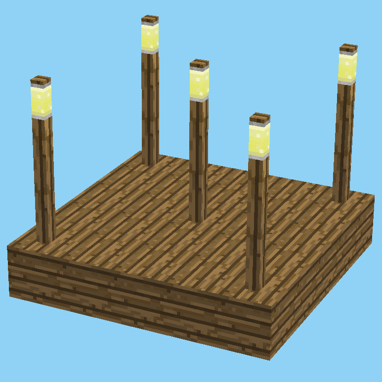
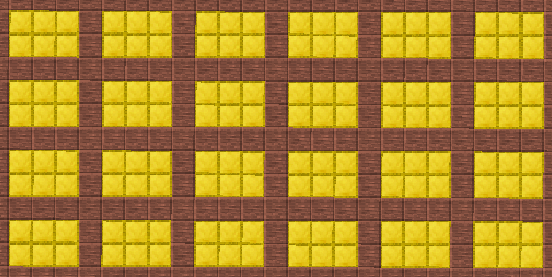
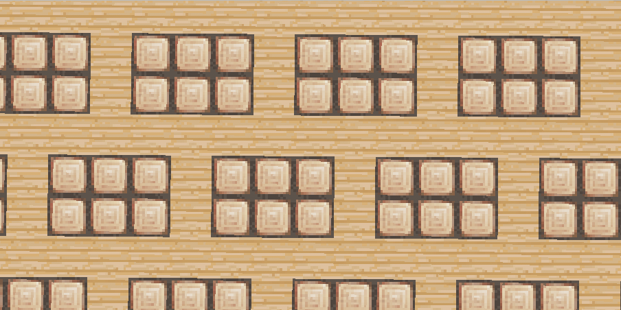
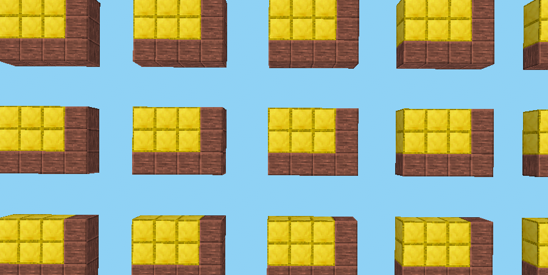

# Placeables

A placeable is something that can be placed in voxel world at a given position: a voxel, a structure or a pattern or even nothing.

## Table of contents

* [Voxels](#voxels)
  * [Minecraft voxel description](#minecraft-voxel-description)
  * [Luanti voxel description](#luanti-voxel-description)
  * [Disambiguation](#disambiguation)
* [Nothing](#nothing)
* [Structures](#structures)
  * [Boxes structures](#boxes-structures)
  * [Blueprint structures](#blueprint-structures)
* [Patterns](#patterns)
  * [Random patterns](#random-patterns)
  * [Repeat patterns](#repeat-patterns)

## Combine placeables

Placeables may have to be combined. This is done by giving a list of placeables instead of a single placeable. Top item will be placed first, then next one, until bottom of the list. Each item overwrites what was placed before.

For example, to have some randomly placed dirt voxels on a grass ground:
```yaml
place:
  - default:dirt_with_grass
  - pattern:
      chance: 0.03
      place: default:dirt
```

## Voxels

Voxel descriptions depend on chosen game format. In both Minecraft and Luanti, voxels are mainly defined by a string (block type or node type). They may have some extra optional parameters (like metadata).

When a string is given as value for a placeable field, it is interpreted as the voxel short form, if supported by the format. Otherwise, full voxel format should be used (object with fields).

Example of a simple voxel value for `place` field:
```yaml
place: default:stone # Stone node in Minetest Game
```

Note: Format-specific voxel short form cannot be used to represent a voxel named `nothing`, as it would collide with the [Nothing](#nothing) placeable short form.

### Minecraft voxel description

See [Minecraft voxel placeable](Minecraft.md#voxel-placeable-description) documentation.

### Luanti voxel description

See [Luanti voxel placeable](Luanti.md#voxel-placeable-description) documentation.

### Disambiguation

Another working notation uses an extra `voxel:` field. It gives exactly the same result and so is useless unless a game field name conflicts with some other placeable keywords:

```yaml
place:
  voxel:
    node: stairs:stair_stone
    param2: 2
```

## Nothing

Places nothing. This is convenient if placeable is required, but you don't want to place anything:

```yaml
place:
  nothing:
```

As `nothing` takes no field, there is a shortcut:

```yaml
place: nothing
```

## Structures

A structure is made of several voxels placed at given position (a tree made of trunk voxels and leaves voxels for example).

Example of a structure as placeable:
```yaml
place:
  structure:
    place: default:dirt
    at: [-1..1, -1..1, -1..1]
```

Structures can be described in different ways. Their "pivot" voxel (voxel corresponding to placing position) is always at (0, 0, 0) in in-structure coordinates.

**NOTE**: Examples here use *Minetest-Game* (Luanti) voxels.

### Boxes structures

Structure can be described as a list of boxes filled with a placeable (could be a voxel, but could be another structure):

```yaml
place:
  structure:
    - place: default:dirt
      at: [-1..1, -1..1, -1..0]
    - place: default:dirt_with_grass
      at: [-1..1, -1..1, 1]
    - place: default:tree
      at: [0, 0, 2]
```

Fields:
- `place`: Placeable to set at given position(s)
- `at`: Where to set that placeable. Can be a single postion, or a box.

Boxes are noted as `[x, y, z]` where `x`, `y` and `z` can be an interval noted `start..end` where `start` and `end` are starting and ending value of the interval, or a single coordinate (`5` is equivalent to `5..5`). All values are integers.

This example will give a structure with a 3x3x3 dirt cube, with grass on top and a tree trunk over it.



Boxes order is important if overlapping. Each box will overwrite any existing material.

### Blueprint structures

Another way to describe structures uses "ASCII art" blueprints. Note that whatever way is used to describe it, the structure object is the same at the end.

Same structure as above could be described as:

```yaml
place:
  structure:
    with:
      'T': default:tree
      'G': default:dirt_with_grass
      'D': default:dirt
    axes: [ z, x, y ]
    blueprint:
      - - "   "
        - " T "
        - "   "
      - - "GGG"
        - "GGG"
        - "GGG"
      - - "DDD"
        - "DDD"
        - "DDD"
      - - "DDD"
        - "DDD"
        - "DDD"
    xOffset: 1
    yOffset: 1
    zOffset: 1
```

Fields:
- `with`: List of characters used in `blueprint` and their corresponding placeable (required).
- `axes`: List of axis in `blueprint` (required). Number of axes will give the number of dimensions. Axes order will tell how to read `blueprint`. First axis correspond to the first level of lists. Last axis correspond to the string of characters.
- `blueprint`: The actual blueprint of the structure (required). It may be a string (1 dimension), a list of strings (2 dimensions), or a list of lists of strings (3 dimensions). First level of list corresponds to the first axis in `axes` and position in string correspond to the last axis (or the unique one if only one dimension). Space character always means `nothing` (no voxel to place) and does not need declaration in `with`. If you need *air* voxels, declare them in `with` using a dot for example.
- `xOffset`, `yOffset`, `zOffset`: an offset to the structure origin point (optional, default 0). The default point is on bottom left of the `blueprint`.

Example of a two-dimensional structure (z is always 0 here):
```yaml
place:
  structure:
    with:
      'W': default:wood
      '-': wool:black
      'O': wool:white
    axes: [ x, y ]
    blueprint:
      - "WWWWWWWWWW"
      - "W-O-O-O-OW"
      - "WO-O-O-O-W"
      - "W-O-O-O-OW"
      - "WO-O-O-O-W"
      - "W-O-O-O-OW"
      - "WO-O-O-O-W"
      - "W-O-O-O-OW"
      - "WO-O-O-O-W"
      - "WWWWWWWWWW"
```

Above structure parameters describes a 2-D checkerboard:



Here is an example of one-dimensional structure (x and y are 0 here):
```yaml
place:
  structure:
    with:
      'W': default:wood
      'P': default:fence_wood
      'L': default:mese_post_light
    axis: z
    blueprint: "WPPPL"
```

### Mixed structure

Box and blueprint structures can be mixed together:

```yaml
place:
  structure:
    - with:
        'W': default:wood
        '-': wool:black
        'O': wool:white
      axes: [ x, y ]
      blueprint:
        - "WWWWWWWWWW"
        - "W-O-O-O-OW"
        - "WO-O-O-O-W"
        - "W-O-O-O-OW"
        - "WO-O-O-O-W"
        - "W-O-O-O-OW"
        - "WO-O-O-O-W"
        - "W-O-O-O-OW"
        - "WO-O-O-O-W"
        - "WWWWWWWWWW"
    - place: default:slab_desert_stone_block
      at: [ 3, 5, 1 ]
    - place: default:slab_silver_sandstone_block
      at: [ 8, 2, 1 ]
```

That draws two pawns on the checkerboard:




### Structure in a structure

Things can get funnier. As a structure is a set of *placeables* (and not only voxels), structures may be used in structures:

```yaml
place:
  structure:
    with:
      'W': default:wood
      'I':
        structure:
          with:
            'W': default:wood
            'P': default:fence_wood
            'L': default:mese_post_light
          axes: z
          blueprint: 'WPPL'
    axes: [ x, y ]
    blueprint:
      - 'IWWWI'
      - 'WWWWW'
      - 'WWIWW'
      - 'WWWWW'
      - 'IWWWI'
```

Which gives that result:


## Patterns

Patterns are sets of voxels but unlike structures, they are not placed at once from given position. Also unlike structures, they are unbounded.
Instead a pattern may tell to a rendering task what to place at a given position according to it. For example it can be used to draw stripes or place trees randomly.

### Random Patterns

This is a basic random pattern placing something or not with a given chance:
```yaml
place:
  pattern:
    chance: 0.5
    place: default:stone
```

Fields:
- `chance`: Chance that placeable will be placed (required).
- `place`: [Placeable](Placeables.md) to place (required).
- `seed`: Random seed (optional default "").

Chance of 0.0 (and lower) means never, chance of 1.0 and higher mean always. In between means the probability (for example 0.25 is 1 chance out of 4).

### Repeat Patterns

A pattern that repeats a [structure](#structures):
```yaml
place:
  pattern:
    repeatStructure:
      with:
        '░': default:goldblock
        '█': default:desert_stone_block
      axes: [ x, y ]
      blueprint:
        - '███'
        - '█░░'
        - '█░░'
        - '█░░'
```



When repeating a structure, you can apply a shift to each repetition along the 3 axes. Here is an example:
```yaml
place:
  pattern:
    repeatStructure:
      with:
        '░': default:goldblock
        '█': default:desert_stone_block
      axes: [ x, y ]
      blueprint:
        - '███'
        - '█░░'
        - '█░░'
        - '█░░'
    eachX:
      shiftY: 2
```



Applying a shift in the direction of the axis results in a space between placements (spacing):
```yaml
place:
  pattern:
    repeatStructure:
      with:
        '░': default:goldblock
        '█': default:desert_stone_block
      axes: [ x, y ]
      blueprint:
        - '███'
        - '█░░'
        - '█░░'
        - '█░░'
    eachX:
      shiftX: 2
    eachY:
      shiftY: 2
```



**Note:** Using negative values in `eachX`/`shiftX`, `eachY`/`shiftY` or `eachZ`/`shiftZ` will crop the structure.

Fields:
- `repeatStructure`: [Structure](#structures) to repeat (required).
- `eachX`: Shift applied for each X-axis repetition (optional):
  - `shiftX`: Spacing applied on X-axis (optional, default `0`).
  - `shiftY`: Shift applied on Y-axis (optional, default `0`).
  - `shiftZ`: Shift applied on Z-axis (optional, default `0`).
- `eachY`: Shift applied for each Y-axis repetition (optional):
  - `shiftX`: Shift applied on X-axis (optional, default `0`).
  - `shiftY`: Spacing applied on Y-axis (optional, default `0`).
  - `shiftZ`: Shift applied on Z-axis (optional, default `0`).
- `eachZ`: Shift applied for each Z-axis repetition (optional):
  - `shiftX`: Shift applied on X-axis (optional, default `0`).
  - `shiftY`: Shift applied on Y-axis (optional, default `0`).
  - `shiftZ`: Spacing applied on Z-axis (optional, default `0`).

**Note:** Non-cubic patterns, such as:
```yaml
place:
  pattern:
    repeatStructure:
      with:
        '/': wool:black
      axes: [ x, y ]
      blueprint:
        - '  /'
        - ' /'
        - '/'
```

Won't be repeated in the world like this:
```
  ///
 ///
///
```

But rather like this:
```
  /  /  /
 /  /  /
/  /  /
```

This is because the pattern repeats the bounding box of the structure, including empty spaces.
