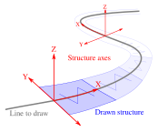
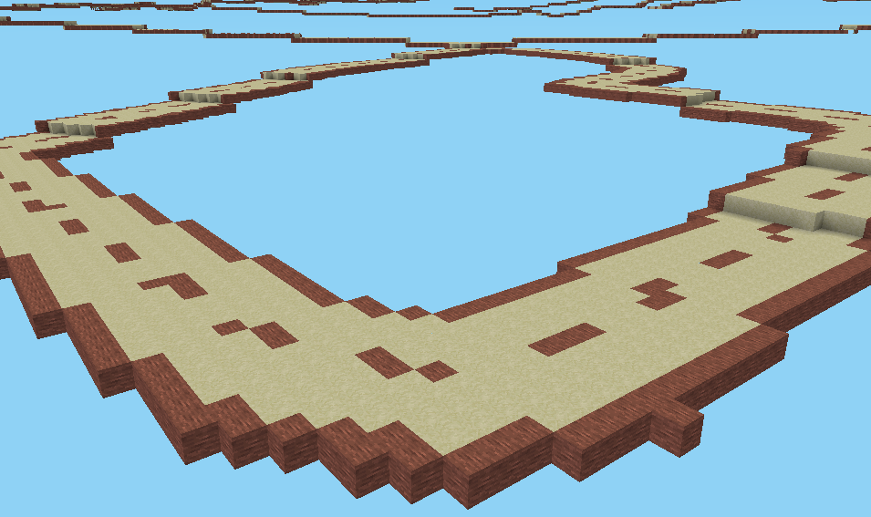
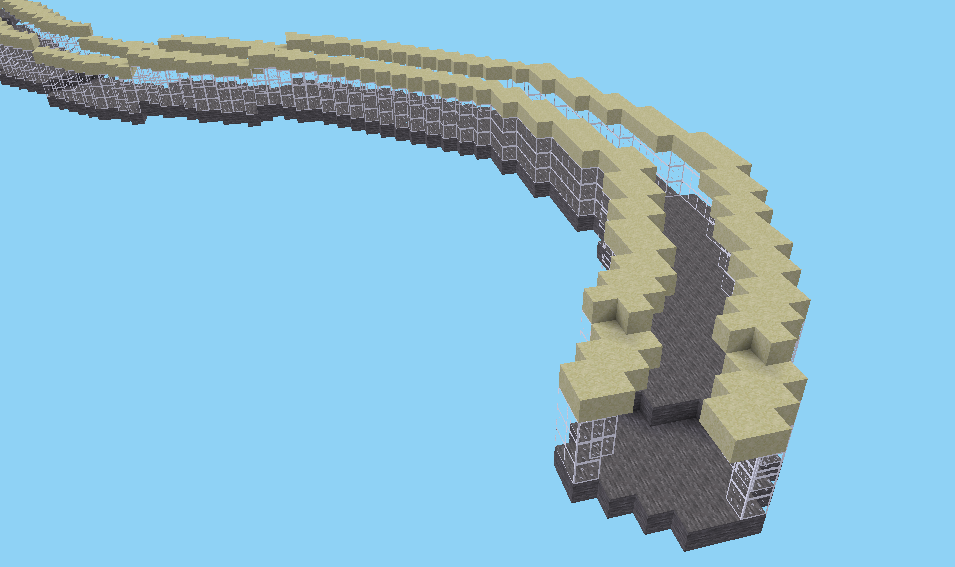
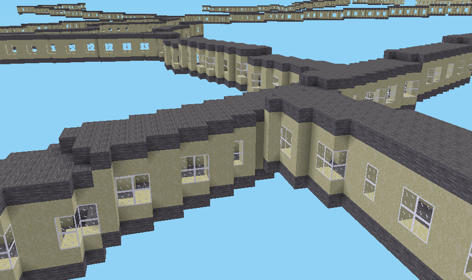

# Tile tasks

Tile tasks will be performed on each tile. They only can be used in a "tile schedule" (for now `forEachTile` only).

Each task has a `type`, optional dependencies to other tasks (in `after`), and other parameters depending on its type.

## Table of contents

* [Tasks fetching data](#tasks-fetching-data)
  * [`fetchData`](#fetchdata)
* [Tasks operating on world](#tasks-operating-on-world)
  * [`renderHeightmap`](#renderheightmap)
  * [`renderLines`](#renderlines)
  * [`renderSurfaces`](#rendersurfaces)
  * [`fillBetweenHeightmapAndMetadata`](#fillbetweenheightmapandmetadata)
  * [`renderBuildings`](#renderbuildings)
  * [`setSpawn`](#setspawn)
* [Tasks operating on heightmaps](#tasks-operating-on-heightmaps)
  * [`populateHeightmap`](#populateheightmap)
  * [`copyHeightmap`](#copyheightmap)
  * [`computeHeightmapStats`](#computeheightmapstats)

## Tasks fetching data

### `fetchData`

Fetches data to be processed. Data may be fetched from various sources.

Parameters for `fetchData` task are described in [FetchDataTask.md](FetchDataTask.md) file.

## Tasks operating on world

These tasks may sometimes be referred as *renderers* as they render voxels (usually from models).

### `renderHeightmap`

Places [placeables](Placeables.md) on one heightmap (`at`) or between two (`minimum` and `maximum`).

#### Extra parameters
- `minimum`: The minimum [heightmap](Heightmaps.md) to use.
- `maximum`: The maximum [heightmap](Heightmaps.md) to use.
- `at`: The [heightmap](Heightmaps.md) to use.
- `place`: The [placeable](Placeables.md) to place at each heightmap voxel.

**NOTE**: `at` cannot be used with `minimum` or `maximum` (when `at` is absent, `minimum` and `maximum` must be used together).

#### Example

This will place grass voxels at the height of the specified heightmap. For better rendering, place voxel structure instead of a single voxel.

```yaml
type: renderHeightmap
at: ground
place: default:grass
```

This will place water voxels between the water and ground heightmaps.
```yaml
type: renderHeightmap
minimum: water
maximum: ground
place: default:water
```

### `renderLines`

Renders 3-D linearities (lines, line strings, linear rings), repeating a given [structure](Placeables.md#structures) along them.

#### Extra parameters

- `models`: [Selection of models](ModelSelection.md) to render (required, models must be convertible to 3d shapes)
- `structure`: [Structure](Placeables.md#structures) to use (required, see below for explanations)
- `renderOnlyWhenAbove`: If this [heightmap](Heightmaps.md) is specified, only parts of that model over it will be rendered (optional)

In given structure, x-axis is along the line, y-axis is in line wideness and z-axis is vertical.

Note that:
- Z-axis is always vertical, regardless of line pitch.
- Structure position will always horizontally be adjusted around line center so `yOffset` (see [Structure documentation](Placeables.md#blueprint-structures)) have no effect.
- As there is no way to know about line orientation (and in most case, this orientation has no sense), it is recommended to use y-axis symmetric structures (like in examples).



#### Example

```yaml
type: renderLines
models:
  type: roads
renderOnlyWhenAbove:
  sum:
    - ground
    - -2
structure:
  axes: [ y, x ]
  blueprint:
    - "██████"
    - "▒▒▒▒▒▒"
    - "▒▒▒▒▒▒"
    - "▒▒▒▒▒▒"
    - "▒▒▒███"
    - "▒▒▒▒▒▒"
    - "▒▒▒▒▒▒"
    - "▒▒▒▒▒▒"
    - "██████"
  with:
    "█": default:desert_stone
    "▒": default:sandstone
```

Here, structure is in yx-plane, so it is seen from above. Structure will be placed along the line and repeated from left to right. Bottom and top are the roads borders:



Here, we use a structure in zy-plane (so along height and width):

```yaml
structure:
  axes: [ z, y ]
  blueprint:
    - "▒▒    ▒▒"
    - "░      ░"
    - "░      ░"
    - "░      ░"
    - "████████"
  with:
    "█": default:stone
    "▒": default:sandstone
    "░": default:glass
```

This will result in a line long extruded shape:



Three-dimensional structures can be used and same rules apply. X-axis is repeated along line, y-axis is from side to side and z-axis is vertical:

```yaml
  structure:
    axes: [ y, z, x ]
    blueprint:
    - - "████"
      - "▒▒▒▒"
      - "▒░░▒"
      - "▒░░▒"
      - "▒▒▒▒"
      - "████"
    - - "████"
      - "    "
      - "    "
      - "    "
      - "    "
      - "████"
    - - "████"
      - "    "
      - "    "
      - "    "
      - "    "
      - "████"
    - - "████"
      - "    "
      - "    "
      - "    "
      - "    "
      - "████"
    - - "████"
      - "▒▒▒▒"
      - "▒░░▒"
      - "▒░░▒"
      - "▒▒▒▒"
      - "████"
    with:
      "█": default:stone
      "▒": default:sandstone
      "░": default:glass
```

The blueprint shows five successive vertical slices of the structure. This will form a sort of long building with windows:



### `renderSurfaces`

Renders 2-D shapes surfaces with [placeables](Placeables.md) on a given [heightmap](Heightmaps.md).

#### Extra parameters

- `models`: [Selection of models](ModelSelection.md) to render (required, models must be convertible to 2d shapes)
- `heightmap`: [Heightmap](Heightmaps.md) to use (required)
- `place`: [Placeable](Placeables.md) to place on each voxel of shapes (required)

#### Examples

Draw "building" shapes with cobble on ground:
```yaml
type: renderSurfaces
models:
  type: building
heightmap: ground
place: default:cobble
```

### `fillBetweenHeightmapAndMetadata`

For each model in [selection](ModelSelection.md), fills the gap between a heightmap and an altitude (given by a model metadata) within the model's boundaries.

If the heightmap value is lower than or equal to the altitude, the placeable used to fill is `placeBelow`, otherwise it is `placeAbove`.

#### Extra parameters

- `models` (required, models must be convertible to 2d shapes): [Selection of models](ModelSelection.md) to use.
- `heightmap` (required): [Heightmap](Heightmaps.md) to use.
- `altitudeMetadata` (required): Name of the model metadata containing the altitude value.
- `placeAbove` (optional, default [`Nothing`](Placeables.md#nothing)): [Placeable](Placeables.md) placed above the altitude value.
- `placeBelow` (optional, default [`Nothing`](Placeables.md#nothing)): [Placeable](Placeables.md) placed below the altitude value.

**NOTE**: It must have at least the `placeBelow` or `placeAbove` field specified

#### Example

```yaml
type: fillBetweenHeightmapAndMetadata
models:
  type: buildings
heightmap: ground
altitudeMetadata: maximum-ground-altitude
placeAbove: air
placeBelow: default:cobble
```

### `renderBuildings`

Renders buildings using selected models as buildings footprint.

Building height is given by `height` metadata (This task does nothing if the value is not an integer, missing, negative, or zero).

#### Extra parameters

- `models` (required, models must be convertible to 2d shapes): [Selection of models](ModelSelection.md) to render
- `roof`: [Placeable](Placeables.md) used to render roofs.
- `wall`: [Placeable](Placeables.md) used to render walls.
- `window`: [Placeable](Placeables.md) used to render windows.

#### Required model metadata

- `height`: Height of the building to render (must be a positive integer). The height is defined as the distance between the minimum ground altitude and the gutter altitude.
- `minimum-ground-altitude`: Minimum altitude inside the shape of the model.
- `ground-floor-altitude`: Ground floor altitude of the model.

#### Example

```yaml
type: renderBuildings
models:
  type: buildings
roof: default:cobble
wall: default:brick
window: default:glass
```

### `setSpawn`
This task sets the initial position of the player.
The provided coordinates must be within the generation limits.
It queries the heightmap to determine the altitude (Z) of the spawn point.

#### Extra parameters

- `heightmap`: [Heightmap](Heightmaps.md) to use (required).
- `x` (int): x-coordinate of the initial position (required).
- `y` (int): y-coordinate of the initial position (required).

#### Example

```yaml
type: setSpawn
heightmap: ground
x: 2
y: -1
```

## Tasks operating on heightmaps

### `populateHeightmap`

Populates a heightmap with models data. Existing data is overwritten.

#### Extra parameters

- `models`: [Selection of models](ModelSelection.md) to use (required, models must be float matrices)
- `heightmap`: [Heightmap](Heightmaps.md) to populate, should be a [stored heightmap](Heightmaps.md#stored-heightmap) as it will be updated (required)

#### Example

```yaml
type: populateHeightmap
models:
  type: altitude
heightmap: ground
```

### `copyHeightmap`

Copies the values of a heightmap to another at all coordinates within the model's shape.

##### Extra parameters

- `models`: [Selection of models](ModelSelection.md) to use as a filter (required, models must be convertible to 2d shapes).
- `from`: [Heightmap](Heightmaps.md) to use.
- `to`: [Heightmap](Heightmaps.md) receiving the values. It should be a [stored heightmap](Heightmaps.md#stored-heightmap).

##### Example

```yaml
type: copyHeightmap
models:
  type: water
from: 1
to: water
```

### `computeHeightmapStats`

Computes heightmap statistics over a model surface and adds the results as metadata.

#### Extra parameters

- `models` (required, models must be convertible to 2d shapes): [Selection of models](ModelSelection.md) to use for computing statistics.
- `heightmap` (required): [Heightmap](Heightmaps.md) to use.
- `compute` (required): Specifies which statistics to compute
  - `maximum` or `max` (optional): Metadata where to store the computed maximum value.
  - `minimum` or `min` (optional): Metadata where to store the computed minimum value.

**NOTE**: The `compute` field must have at least one optional subfield specified.

#### Example

```yaml
type: computeHeightmapStats
models:
  type: building
heightmap: ground
compute:
  maximum: maximum-ground-altitude
  minimum: minimum-ground-altitude
```
